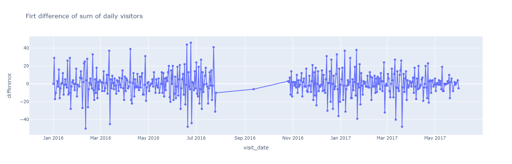
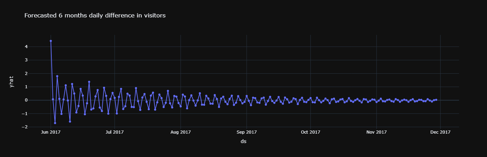
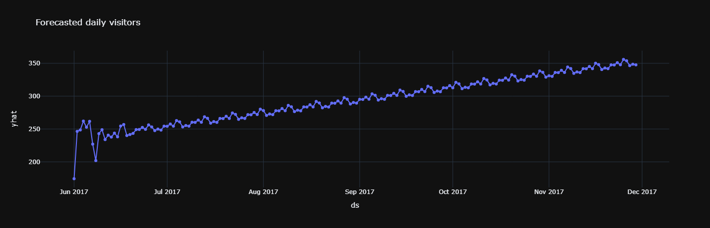
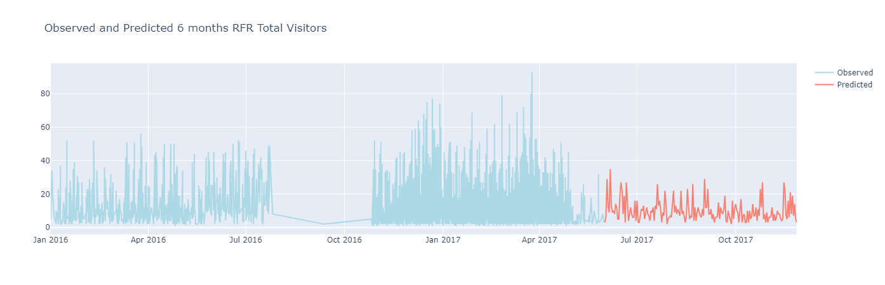

# BI-Challenge
Repository that includes a Business Intelligence Challenge in which we develop a SQL database and then create multiple forecasts to predict restaurant visitors in the next 6 months.
# Relevant Results
## Exploratory Data Analysis
### Holidays

Holidays seem to be a huge determinant in non-holiday days as they drive the visitors towards the holiday trend.

As we can see the first difference in the visitor's data makes it stationary.
### Simple ARIMA forecast

Since the series is differentiated, the predictions tend to converge in the future towards 0, this is the most simple forecast, and even though it can help to watch the pattern it's not the same as the original series output so it's difficult to interpret the results, let's continue to see if there are better ways.
### SARIMAX prediction

When we see both graphs we see that the model has an upward trend and weekly seasonal spikes, though the model is fitted properly the actual vs. predicted test is not that consistent, and overall the sarimax tends to stay in the same shape at the end. Compared to the simple ARIMA the results are more fulfilling but overall the prediction is of medium to low quality and should be compared to other approaches.
### Random Forest Regressor Prediction

The previous plot shows the actual vs. predicted values of the model, we can see that the predictions have less inaccuracy presenting a 10.340 RMSE which is an understandable prediction, the predicted values are much closer to the actual values which is a good indication of the potential of this model to succeed as a baseline. We continue with the same process to predict the next 6 months

This random forest prediction is more consistent with the latest data range and trend since it doesn't go towards the negative numbers and rather stays consistent within 5 to 40 visitors a day. We can visualize this in the next graph

